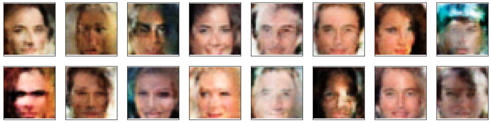

# Face Generation with GANs
The project consists of generating new images of faces that look as realistic as possible. The goal is to build and train a generative adversarial network (GAN) using a dataset of celebrity faces — the [CelebFaces Attributes Dataset (CelebA)](http://mmlab.ie.cuhk.edu.hk/projects/CelebA.html). The project is composed of the following steps:
* Pre-process the data
* Create a data loader
* Define the model
  * Discriminator
  * Generator
* Build the network combining the Discriminator and Generator
* Define discriminator and generator losses
* Train the model with the Adam optimizer

## Project implementation
The project implementation complies with Udacity's list of [rubric points](https://review.udacity.com/#!/rubrics/2261/view) required to pass the project and can be found in the respective [Jupyter notebook](./dlnd_face_generation.ipynb).

### Network Architecture
The network architecture of this project has been built using the [DCGAN architecture](https://arxiv.org/pdf/1511.06434.pdf) as a reference. It is composed of a discriminator and a generator models which are detailed below.

#### Discriminator
The discriminator is mainly composed of convolutional layers without maxpooling and performs the downsampling process using a stride of 2. The output of the network is either 1 or 0, indicating whether the image is fake or real.

| Layer         		|     Description	        					                                |
|:-----------------:|:-----------------------------------------------------------------:|
| Input         		| 32x32x3 tensor images   				                        	        |
| Convolution 4x4  	| 2x2 stride, 1 padding, no batch normalization, outputs 16x16x64 	|
| Leaky RELU		    |	Slope of 0.2										                         	        |
| Convolution 4x4  	| 2x2 stride, 1 padding, with batch normalization, outputs 8x8x128  |
| Leaky RELU		    |	Slope of 0.2										                         	        |
| Convolution 4x4  	| 2x2 stride, 1 padding, with batch normalization, outputs 4x4x256  |
| Leaky RELU		    |	Slope of 0.2										                         	        |
| Convolution 4x4  	| 2x2 stride, 1 padding, with batch normalization, outputs 2x2x512  |
| Leaky RELU		    |	Slope of 0.2										                         	        |
| Flattening	   		| Output 2x2x512 = 2048                             								|
| Fully connected 	| Output 1									                                        |

#### Generator
The generator takes a random vector Z and learns to generate "realistic" images that can be send to the discriminator. This is, it upsamples the random vector until it gets a 32x32x3 image. For the upsampling process, the model uses a stack of transposed convolutional layers with a stride of 2.

| Layer         	           | Description     	        					                                |
|:--------------------------:|:------------------------------------------------------------------:|
| Input         		         | Vector of size 100 			                        	                |
| Fully connected 	         | Output 2x2x512						                                          |
| Transp. Convolution 2D 4x4 | 2x2 stride, 1 padding, with batch normalization, outputs 4x4x256 	|
| RELU		                   |              										                         	        |
| Transp. Convolution 2D 4x4 | 2x2 stride, 1 padding, with batch normalization, outputs 8x8x128 	|
| RELU		                   |              										                         	        |
| Transp. Convolution 2D 4x4 | 2x2 stride, 1 padding, with batch normalization, outputs 16x16x64 	|
| RELU		                   |              										                         	        |
| Transp. Convolution 2D 4x4 | 2x2 stride, 1 padding, no   batch normalization, outputs 32x32x3 	|
| Tanh		                   |              										                         	        |

### Example of the generated faces

### General notes about the results
The generated samples capture the main features of a face, such as the shape and the number and position of eyes, nose, mouth and hair. However, the model does not seem to capture the relationships on image borders successfully. Moreover, the generated samples are not as neat as the training images; instead, they have some level of blur and noise. Another flaw of the model is that it captures the bias present in the training dataset composed of white celebrity faces.

To improve the model, it would be reasonable to consider a higher number of epochs until reaching a sufficient plateau, mainly for the generator. Furthermore, larger image sizes might take longer to train, but the model learns more features since the feature space is higher. The face generation could also return a greater variety of faces if it did not have the aforementioned bias in the training set. This improvement could be achieved by upsampling the dataset with other types of faces until a given balance is reached. Another possible alternative is to consider Resnet layers in the generator like the ones used in [Zhu et al. (2020)](https://arxiv.org/pdf/1703.10593.pdf) to capture the content of face images.

Having mentioned both the pros and cons and taking into account the relatively short training time, I consider that the model does a fair job by taking random data and generate an image that contains the main features of a face.

## Notes
This project contains my implementation of the "Face Generation" project for the Udacity's [Deep Learning program](https://www.udacity.com/course/deep-learning-nanodegree--nd101). The baseline code has been taken from the [Udacity's Deep Learning repository](https://github.com/udacity/deep-learning-v2-pytorch).
